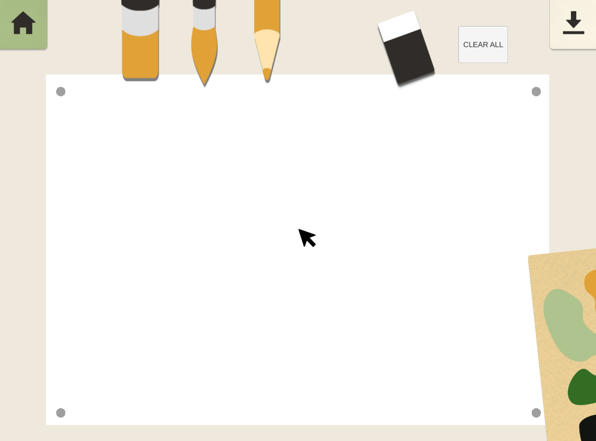

# HCARD_Augmentation_2023
Welcome to the HCARD Augmentation 2023 repository! This repository contains the source code for an AI-driven motion tracking drawing application created as part of the Human Centered Design of Assistive and Rehabilitation Devices course at Imperial College London.

<!-- ABOUT THE PROJECT -->
## Project Overview

The HCARD Augmentation project is aimed at developing a drawing application that uses AI-driven motion tracking to assist users with limited mobility or dexterity in creating art. The application will track the user's movements and translate them into a digital medium, allowing them to create beautiful works of art without having to hold or manipulate traditional drawing tools.

https://user-images.githubusercontent.com/113228076/227746031-5bfbe697-b20e-497f-8b04-9bd313788bb0.MP4

## Prerequisites

  

<!--This project is written in Python programming language.  -->
The following are the major open source packages utilised in this project:

* Numpy
* Pandas
* OpenCV
* MediaPipe
* Imutils

## Project Structure

The project is structured as follows:

<h2 id="folder-structure"> Folder Structure</h2>

## 🎯 Getting Started
To get started with the HCARD Augmentation project, follow these steps:

Clone the repository to your local machine.
Install the necessary dependencies by running pip install -r requirements.txt.
Run the application by executing the python file in your terminal.

## Future Work

## Contributing

We welcome contributions from anyone interested in the HCARD Augmentation project. If you'd like to contribute, please fork the repository and create a pull request with your changes. Before submitting a pull request, please ensure that your changes are well-tested and conform to the project's code style and standards.

## Acknowledgements

We would like to express our sincere gratitude to Professor Etienne Burdet, our course instructor, and our Teaching Assistants, Dr Yanpei Huang, Lucille Cazenave, and Alexis Devillard, for their invaluable guidance, encouragement, and feedback throughout the development of this project. We would also like to extend our thanks to Paschal Egan for his support in Electronics Laboratory.

We are grateful to the Imperial College London BioEngineering department for their continued support of the HCARD program. 
